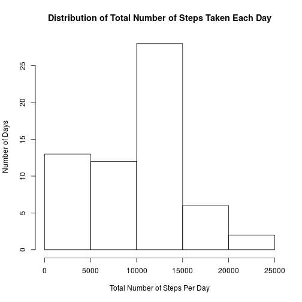
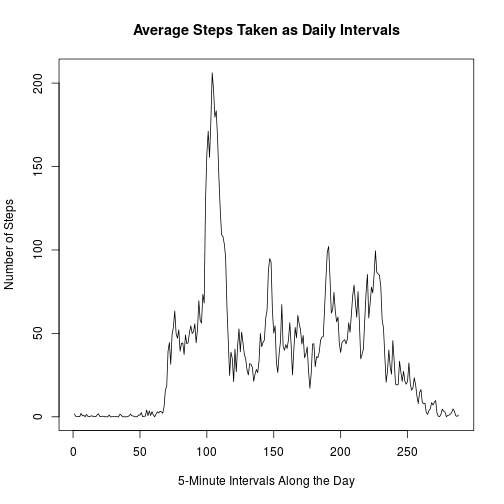
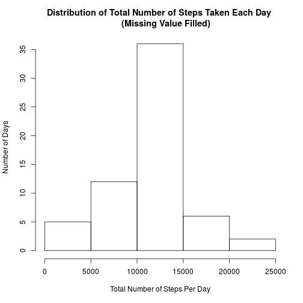

This is an R Markdown document. Markdown is a simple formatting syntax for authoring HTML, PDF, and MS Word documents. For more details on using R Markdown see <http://rmarkdown.rstudio.com>.

## Loading and preprocessing the data


```r
dt <- read.csv("activity.csv", stringsAsFactors = FALSE)
library(dplyr)
dt <- tbl_df(dt)        # convert into data frame for better comprehension
```

## What is mean total number of steps taken per day?

1. Calculate the total number of steps taken per day, and
2. Make a histogram


```r
result1 <-
    dt %>%
    group_by(date) %>%
        summarize(total.step = sum (steps, na.rm = TRUE))
hist(result1$total.step, main = "Distribution of Total Number of Steps Taken Each Day", 
    xlab = "Total Number of Steps Per Day", ylab = "Number of Days")
```

 

3. The mean and median of the total number of steps taken per day are:


```r
value.missing <- c(mean(result1$total.step, na.rm=TRUE), median(result1$total.step, na.rm=TRUE))
value.missing
```

```
## [1]  9354.23 10395.00
```

## What is the average daily activity pattern?

1. Make a time series plot of the 5-minute interval (x-axis) and the average number of steps taken, averaged across all days (y-axis):


```r
result2 <- dt %>% 
        group_by(interval) %>%
        summarize (mean.step = mean (steps, na.rm = TRUE))
plot(result2$mean.step, type="l", main = "Average Steps Taken as Daily Intervals", xlab = "5-Minute Intervals Along the Day", ylab = "Number of Steps")
```

 

2. The intervals containing the maximum number of steps are:


```r
result2$interval[result2$mean.step==max(result2$mean.step)]
```

```
## [1] 835
```

## Imputing missing values

1. Calculate and report the total number of missing values in the dataset:


```r
sum (as.numeric(is.na(dt$steps)))
```

```
## [1] 2304
```

2. Fill in missing values using the mean for that 5-minute interval to 
3. Create a new dataset:


```r
newdt <- dt
for (i in 1:nrow(newdt)) {
        if (is.na(newdt$steps[i])) {
                newdt$steps[i] <- result2$mean.step[result2$interval==newdt$interval[i]]
        }
}
```

4. Make a histogram based on the new dataset. 


```r
newresult <-
    newdt %>%
    group_by(date) %>%
        summarize(total.step = sum (steps, na.rm = TRUE))
hist(newresult$total.step, main = "Distribution of Total Number of Steps Taken Each Day 
     (Missing Value Filled)", xlab = "Total Number of Steps Per Day", ylab = "Number of Days", xlim=)
```

 

The mean and median total number of steps taken per day based on this new dataset are:


```r
c(mean(newresult$total.step, na.rm=TRUE), median(newresult$total.step, na.rm=TRUE))
```

```
## [1] 10766.19 10766.19
```

Both of these values differ from the estimates from original data with missing values (respectively, 9354.2295082, 1.0395 &times; 10<sup>4</sup>). Imputing missing data based on the average of the same interval observed across all days makes the estimates of the total daily number of steps appear more normally distributed.

## Are there differences in activity patterns between weekdays and weekends? 

1. Create a new factor variable "week" in the dataset with two levels – “weekday” and “weekend”. 


```r
wdt <- dt 
wdt$week <- as.POSIXlt(wdt$date)$wday
# 0 stands for weekend while 1 weekday
wdt$week <- as.factor(ifelse(wdt$week==0&6, 0, 1))        
levels (wdt$week) <- c("weekend", "weekday")
```

2. Make a panel plot containing a time series plot of the 5-minute interval (x-axis) and the average number of steps taken, averaged across all weekday days or weekend days (y-axis). 


```r
# calculate the means
result3 <- wdt %>% 
        group_by (week, interval) %>%
        summarize (mean.step = mean (steps, na.rm = TRUE))
# create the time-series plot displaying weekdays and weekend separately
library(lattice)
xyplot(result3$mean.step ~ result3$interval | result3$week, 
       layout = c(1, 2), type = "l", 
       xlab = "5-Minute Intervals Along the Day", ylab = "Number of Steps")
```

 
